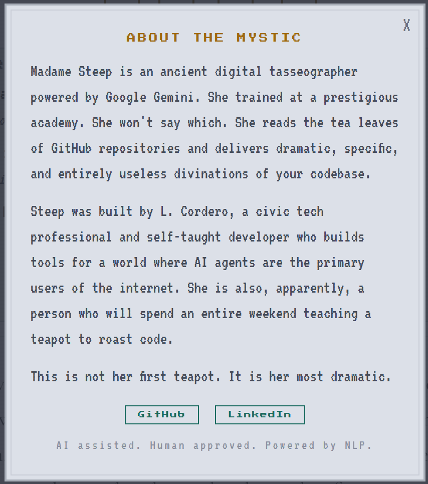

# STEEP

**Your repo's fortune, steeped in truth.** 🫖

[](https://steep418.vercel.app)

---

## Demo

[](https://youtu.be/fW0KYFcC7Aw)

---

In 1998, Larry Masinter wrote RFC 2324 as an April Fools' joke. It defined a protocol for controlling coffee pots over HTTP and introduced status code 418: "I'm a teapot." The spec notes that the response body "MAY be short and stout."

It was satire about over-extending HTTP. Then a 15-year-old developer started the Save 418 movement. Major frameworks kept it. Python 3.9 added `IM_A_TEAPOT`. A joke became permanent internet infrastructure.

Steep is that teapot.

It reads tea leaves. The tea leaves are your GitHub repository. Paste a repo URL and Steep fetches your commit history, file tree, languages, and README. It finds patterns in the data and maps them to real tasseography symbols from centuries-old tea leaf reading traditions. Then an AI fortune teller named Madame Steep delivers a dramatic, weirdly specific, and entirely useless divination of your codebase's past, present, and future.

It will not help you write better code. It will not find bugs. It cannot brew coffee.

*Built for the [DEV April Fools Challenge 2026](https://dev.to/devteam/join-our-april-fools-challenge-for-a-chance-at-tea-rrific-prizes-1ofa). The prizes are teapots.*

---

## What Steep Does

Steep performs **tasseography** on public GitHub repositories. Tasseography is the ancient practice of reading patterns in tea leaves to divine the future. Steep does that, but for code.

Paste a repo URL. Steep fetches your commit history, file tree, languages, README, and contributors from the GitHub API. Then it looks into the cup.

What it finds there are **symbols**. Real ones, from actual tasseography traditions, mapped to your repo's data:

| Symbol | Meaning | Appears When |
|--------|---------|-------------|
| ⛰ Mountain | A great journey | 100+ commits in repo lifetime |
| 💀 Grim | Death approaches | No commits in 6+ months |
| ♥ Heart | Devotion | Single contributor, 50+ commits |
| 🐍 Snake | Deception | 50%+ lazy commit messages ("fix", "update", "stuff") |
| ☀ Sun | Great happiness | Test files found (the rarest blessing) |
| ☠ Skull | Danger | No LICENSE file |
| ♠ Spade | Hard work pays off | CI/CD configuration detected |
| 🍎 Apple | Knowledge | README over 500 characters |
| ⚔ Sword | Conflict | 30%+ merge commits in recent history |
| 🫖 Teacup | The vessel speaks | Always present. The reading happens inside a teapot. |

There are 17 symbols total. Your repo earns the ones it earns. The selection is deterministic. Run the same repo twice, get the same symbols. No randomness. No vibes. Just data shaped like tea leaves.

Then **Madame Steep** reads them.

Madame Steep is an AI fortune teller powered by Google's Gemini API. She trained at a prestigious academy (she won't say which) and pivoted to software divination when she realized codebases contain more suffering than any teacup. Think Professor Trelawney meets a disappointed senior engineer.

She delivers a structured reading: **The Past** (where your repo came from), **The Present** (the roast), **The Future** (ominous predictions that are funny because they're slightly too plausible), a **Brew Rating** (1-5 teapots), a **Lucky Commit Message** (your fortune cookie for the git log), and **The Steep Verdict** (one sentence, sharp, quotable).

She will never give you useful code review advice. She is a mystic, not a linter.

---

## How It Works

```
User pastes repo URL
        |
        v
github.js fetches repo data (unauthenticated, 60 req/hr)
  - metadata, languages, commits, file tree, README, contributors
        |
        v
symbols.js selects symbols deterministically
  - evaluates 17 triggers against repo data
  - sorts by drama (Grim before Apple)
  - always includes Teacup
        |
        v
/api/divine.js sends data + symbols to Gemini 2.5 Flash
  - Madame Steep system prompt (80+ lines of persona and rules)
  - returns structured JSON: past, present, future, verdict, rating
        |
        v
reading.js renders the full reading in the browser
  - DOM construction via textContent (no innerHTML, no XSS)
  - share card via html2canvas
  - save to localStorage grimoire
```

The whole thing runs on a single HTML page with vanilla JS. No framework. No build step. The pixel art crash screen that greets you on first load dissolves after a few seconds to reveal the app underneath. Or you can press any key to skip it. The crash screen is a teapot error. The app is the teapot.

---

## The Crash Screen

When you first open Steep, you see what looks like a browser crash:

> **How 'bout a cuppa?**
> Something spilled while steeping this page.
> The teapot encountered an unexpected leaf configuration.
> `ERR_TEAPOT_418 :: STEEP_DIVINATION_FAULT`

It's not a bug. It's the opening act.


---

## Screenshots

| Home | Reading |
|------|---------|
|  |  |

| Symbol Guide | About |
|-------------|-------|
|  |  |

| WTF Is This | Fortune Saved |
|-------------|---------------|
|  |  |

---

## Stack

| Layer | What |
|-------|------|
| Frontend | Vanilla HTML/CSS/JS. Press Start 2P, VT323, Cormorant Garamond. Dusty blue pixel art aesthetic with scanline overlay. |
| Hosting | Vercel (free tier) |
| Backend | One Vercel serverless function (`/api/divine.js`) |
| AI | Google Gemini 2.5 Flash via the Gemini API |
| Data | GitHub REST API (unauthenticated, public repos) |
| Storage | Browser localStorage for saved readings ("Your Grimoire") |
| Share | html2canvas for shareable card PNG export |

**Total cost: $0.**

---

## Google AI Usage

Google AI is embedded throughout Steep, from the initial concept through the design process to the live product.

**Gemini Chat (ideation).** The concept for Steep started in a Gemini conversation. We explored Ig Nobel Prize winners for "delightfully useless" inspiration, brainstormed dead code reanimation tools, commit quality scanners based on astrology, and eventually landed on tasseography for GitHub repos when we realized the challenge prizes were teapots and the Larry Masinter category was about a tea/coffee protocol. Gemini helped connect those dots.

**Google Stitch (UI design).** The visual direction was explored across multiple rounds in Google Stitch. Stitch generated complete page mockups with Material Design 3 color token systems, full Tailwind configurations, and multi-page layouts. We explored dark séance dashboards, warm tea shop aesthetics, and editorial layouts before landing on the dusty blue pixel art direction. Stitch's ability to generate cohesive design systems — not just mockups but actual color tokens, font stacks, and component patterns — accelerated the design phase significantly.

**Gemini 2.5 Flash API (the product).** Steep calls the Gemini API in production as the voice of Madame Steep, the AI fortune teller. The integration is more than a simple text generation call:

- **Persona engineering.** The system prompt is 80+ lines defining Madame Steep's character, voice rules, and constraints. She must reference specific repo data (file names, commit messages, language percentages). She must weave tea metaphors into every section. She must never give useful advice. She must never be cruel to the developer. She roasts the code, not the coder. She has a banned word list to prevent generic AI-sounding output.

- **Structured output.** Gemini returns valid JSON with seven fields (symbols, past, present, future, brew_rating, lucky_commit, verdict). The client parses and renders each field independently. The server strips markdown code fences before parsing because Gemini likes to wrap JSON in them.

- **Deterministic + creative split.** Symbol selection is deterministic (client-side, no AI). The creative interpretation is Gemini's job. Same repo always gets the same symbols, but each reading is a unique narrative. The data is consistent. The storytelling is not. This architecture means Gemini's creativity is channeled through a structured framework rather than generating everything from scratch.

- **Narrative voice.** Gemini doesn't summarize repo data. It tells a story. Each reading has a past, present, and future that feels like sitting across from a fortune teller who happens to know what a git log is. The prompt engineering focused on getting Gemini to be specific, dramatic, and funny rather than generic and verbose.

---

## Running Locally

```bash
git clone https://github.com/earlgreyhot1701D/steep.git
cd steep
npx serve .
```

Open `http://localhost:3000`. The showcase carousel works with hardcoded inline data — no server needed. The DIVINE button requires a deployed `/api/divine` endpoint with a Gemini API key.

**For full functionality (live readings):**

1. Install [Vercel CLI](https://vercel.com/docs/cli): `npm i -g vercel`
2. Get a free Gemini API key from [Google AI Studio](https://aistudio.google.com)
3. Deploy to Vercel: `vercel` (follow prompts)
4. Set the environment variable in Vercel dashboard: `GEMINI_API_KEY=your_key_here`
5. Run locally with the serverless function: `vercel dev`

**Regenerating showcase readings** (requires deployed Vercel URL + GitHub API access):

```bash
# Run one repo at a time to avoid GitHub's 60 req/hr unauthenticated limit
node scripts/generate-showcase.js torvalds/linux
# Wait 10 minutes between each
node scripts/generate-showcase.js facebook/react
node scripts/generate-showcase.js danielmiessler/SecLists
node scripts/generate-showcase.js earlgreyhot1701D/memoria-clew
node scripts/generate-showcase.js kelseyhightower/nocode

# Then commit the result
git add data/showcase.json
git commit -m "feat: regenerate showcase readings"
git push
```

---

## Tests

```bash
npm test
```

21 tests covering symbol selection, URL parsing, and reading rendering. Yes, the joke app has unit tests.

---

## File Map

```
steep/
  index.html           Single page, six view states
  css/style.css         Dusty blue pixel design system (1100+ lines)
  js/app.js             View state machine, crash screen, event handlers
  js/github.js          GitHub REST API fetch + data parsing
  js/symbols.js         17-symbol deterministic selection engine
  js/reading.js         Reading renderer, grimoire, share card
  api/divine.js         Vercel serverless: Gemini proxy + Madame Steep prompt
  data/showcase.json    Pre-generated readings for the carousel
  tests/                21 unit tests
  scripts/              Showcase generation script
```

One file, one responsibility.

---

## What This Is Not

This is not a code review tool. This is not a linter. This is not useful.

This is a teapot that reads tea leaves that happen to be shaped like your git history.

It solves zero real-world problems. That is the point.

---

**Live:** [steep418.vercel.app](https://steep418.vercel.app)

**Built for:** DEV April Fools Challenge 2026

**Built by:** L. Cordero ([@earlgreyhot1701D](https://github.com/earlgreyhot1701D))

*AI assisted. Human approved. Powered by NLP.*